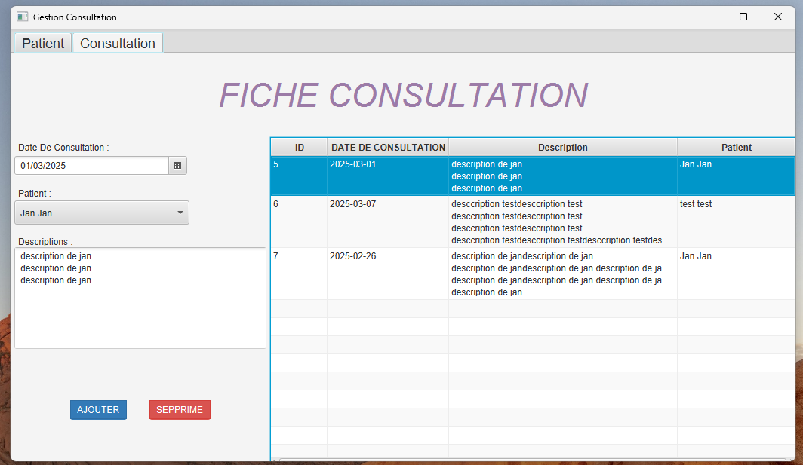

<h1>Gestion Cabinet</h1>

<ul>
    <ol><h3>FICHE PATIENT</h3>
        <ul> 
            <li><h5>Ajouter Patient</h5></li>
            
            
            <li><h5>odification Patient</h5></li>
            
            
            <li><h5>uppression Patient</h5></li>
            
            
            <li><h5>Recherche Patient</h5></li>
            
            
            
        </ul>
    </ol>
    <ol><h3>FICHE CONSULTATION</h3>
        <ul> 
            <li><h5>Ajouter Consultation</h5></li>
            
            
            <li><h5>Supprime Consultation</h5></li>
            
            
        </ul>
    </ol>
</ul>

